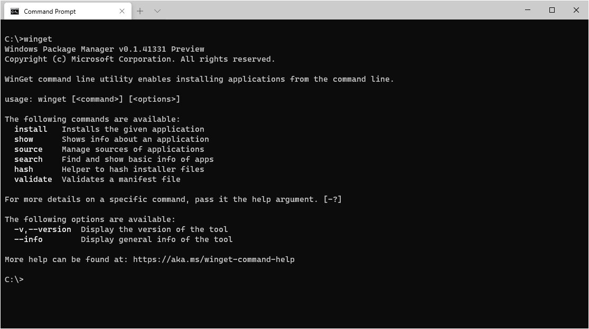

# Windows ENV installs
<!-- TOC -->

- [Windows ENV installs](#windows-env-installs)
    - [Chocolatey](#chocolatey)
        - [Chocolatey install scripts](#chocolatey-install-scripts)
        - [Usage](#usage)
        - [Documentation](#documentation)
        - [Applications included in install.bat](#applications-included-in-installbat)
    - [Winget](#winget)
        - [Usage](#usage)
        - [Applications included in winget.bat](#applications-included-in-wingetbat)

<!-- /TOC -->
---

## Chocolatey


Para um guia em português de como usar o chocolatey para instalar suas dependências, basta acessar este [link](https://www.godela.com.br/noticia/1733/como-usar-o-chocolatey/).

This repository contains installation and update scripts, I use in my daily work.
They depend on [chocolatey](http://chocolatey.org/), which is the package manager, I like most on Windows.

For the Linux SO, try [https://github.com/georgemaia/env-linux](https://github.com/georgemaia/env-linux).


### Chocolatey install scripts

Chocolatey is a package manager for windows, allowing you to install apps with a single command. This is how you install git using chocolatey: ```choco install git```

See [github repo](https://github.com/chocolatey/choco)

---

### Usage

**First install Chocolatey using cmd**

```
Set-ExecutionPolicy Bypass -Scope Process -Force; [System.Net.ServicePointManager]::SecurityProtocol = [System.Net.ServicePointManager]::SecurityProtocol -bor 3072; iex ((New-Object System.Net.WebClient).DownloadString('https://chocolatey.org/install.ps1'))
```

After start `cmd.exe` as administrator and run [install.bat](install.bat).

You can simply switch from manual installation to chocolatey, because chocolatey uses the installers provided by the software vendors.
They should be capabale to recognize an existing installation.

Run [update-all.bat](update-all.bat) from time to time to ensure that all packages are up to date.

---

### Documentation
Please see the [wiki](https://github.com/chocolatey/choco/wiki)

Give `choco.exe /?` a shot (or `choco.exe -h`). For specific commands, add the command and then the help switch e.g. `choco.exe install -h`.

Check out [Chocolatey's homepage](https://chocolatey.org/) or this [github repo](https://github.com/chocolatey/chocolatey).

---

### Applications included in install.bat

* 7-Zip
* Adobe Acrobat Reader DC
* Amazon Send to Kindle
* Anaconda Notebook
* Android Studio
* Anydesk
* Brave Browser
* Calibre
* Composer - Php Dependency Manager
* DBeaver
* Docker-Desktop
* Dropbox
* Fira Code Font
* FileZilla Client
* Firefox
* Font-Awesome
* Gradle
* Git
* Insomnia
* IntelliJidea Community
* Kdenlive
* LibreOffice
* MEGAsync
* Microsoft PowerToys
* Microsoft Visual Studio Code
* Obs-studio
* Openshot
* Oracle VM VirtualBox
* Pandoc
* Putty
* sql-server-management-studio
* Python 3
* SyncToy
* Synctrayzor
* TeamViewer
* Ventoy
* VeraCrypt
* VLC media player
* VMWare Workstation Player
* VNC Viewer
* VS Code
* WindirStat
* WinSCP
* XAMPP

---

## Winget



Windows Package Manager (winget) is a command-line utility developed by Microsoft for Windows 10 and later versions. It is designed to simplify the process of installing, updating, configuring, and managing software applications on Windows machines.

Documentação Oficial Winget: https://learn.microsoft.com/en-us/windows/package-manager/winget/

### Usage

Here are some common commands and examples of how to use winget:

**Search for Packages**: To search for a package, you can use the search command. For example:

```bash
winget search application_name
```

**Install a Package**: To install a package, use the install command along with the package name. For example:

```bash
winget install package_name
```

**List Installed Packages**:  You can list all installed packages using the list command:

```bash
winget list
```

**Uninstall a Package**: To uninstall a package, use the uninstall command followed by the package name:

```bash
winget uninstall package_name
```

**Update All Packages**: You can update all installed packages to their latest versions with the upgrade command:

```bash
winget upgrade --all
```

**Show Package Information**: To view detailed information about a package, you can use the show command:

```bash
winget show package_name
```

**Install Packages from Manifest Files**: You can use package manifest files (.yaml) to install packages with specific configurations. For example:

```bash
winget install -m path\to\package.yaml
```

Configure Source Repositories: You can add custom sources or repositories for package management using the source command. This allows you to access additional software packages not included in the default Microsoft repository.

Call a instalation bat:

After start `cmd.exe` as administrator and run [winget.bat](winget.bat).

### Applications included in winget.bat

- 7-Zip
- Adobe Acrobat Reader 64-bit
- Brave
- Git
- Laragon
- Microsoft Visual Studio Code
- Obsidian
